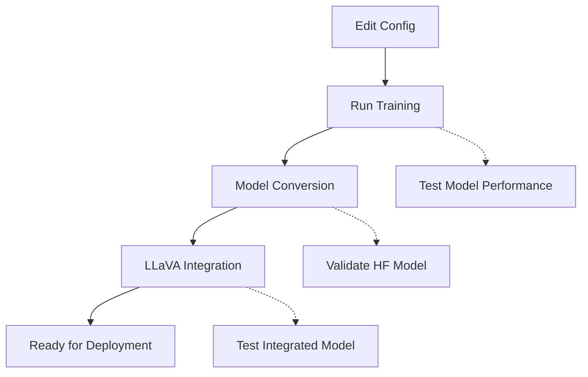

# AIGC Detection with Configuration System

A comprehensive AIGC (AI-Generated Content) detection framework with unified configuration management, supporting visual pretraining and automatic model conversion to HuggingFace format.

## ✨ Features

- **🔧 Unified Configuration**: All parameters managed through YAML configuration files
- **🚀 Complete Pipeline**: Training → HuggingFace Conversion → LLaVA Integration
- **🎯 Multiple Training Modes**: NPR, CLIP+LoRA, CNNDetection, and rine
- **🔄 Modular Design**: Run components independently or as complete pipeline
- **📊 Comprehensive Testing**: Multi-dataset evaluation with detailed metrics
- **🛠️ Easy Setup**: Quick start script and example configurations

## 🚀 Quick Start

### 1. Setup
```bash
# Clone and navigate to the project
cd Baselines_AIGI

# Run quick setup
./quick_start.sh

# Edit configuration with your paths
cp config_example.yaml my_config.yaml
vim my_config.yaml
```

### 2. Run Complete Pipeline
```bash
# Full pipeline: training + conversion + integration
python train_with_config.py --config my_config.yaml
```

### 3. Run Individual Components
```bash
# Training only
python train_with_config.py --config my_config.yaml

# Model conversion only
python convert_weight2hf_config.py --config my_config.yaml

# LLaVA vision replacement only
python transform_vision_model_config.py --config my_config.yaml
```

## 📁 Project Structure

```
Baselines_AIGI/
├── 📋 Configuration Files
│   ├── config.yaml              # Main configuration template
│   ├── config_example.yaml      # Detailed example configuration
│   └── config_loader.py         # Configuration management class
│
├── 🎯 Training & Conversion Scripts  
│   ├── train_with_config.py           # Unified training pipeline
│   ├── convert_weight2hf_config.py    # Model → HuggingFace conversion
│   └── transform_vision_model_config.py # LLaVA vision replacement
│
├── 📚 Documentation
│   ├── README.md                 # This file
│   ├── README_CONFIG.md          # Detailed usage guide
│   └── CONFIG_SYSTEM_SUMMARY.md # Complete feature summary
│
├── 🛠️ Setup & Dependencies
│   ├── quick_start.sh           # Automated setup script
│   ├── requirements_config.txt  # Python dependencies
│   └── requirements.txt         # Legacy requirements
│
└── 🧠 Core Components
    ├── options/                 # Training options
    ├── networks/                # Model architectures  
    ├── models/                  # Model implementations
    ├── data/                    # Data loading utilities
    ├── validate.py              # Validation functions
    ├── util.py                  # Utility functions
    ├── models.py                # Model definitions
    └── test_huggingface.py      # HuggingFace testing
```

## ⚙️ Configuration

### Key Configuration Sections

```yaml
# Data paths
data:
  train_dataroot: "/path/to/training/data"
  test_dataroot: "/path/to/test/data"

# Model settings
training:
  trainmode: "lora"  # Options: "NPR", "lora", "CNNDetection", "rine"
  lr: 0.0001
  batch_size: 16
  niter: 1000

# Pretrained models
models:
  pretrained:
    clip_model: "/path/to/clip-vit-large-patch14-336"
    llava_model: "/path/to/llava-v1.6-mistral-7b-hf"
```

### Training Modes

| Mode | Description | Use Case |
|------|-------------|----------|
| `NPR` | Standard training | General purpose detection |
| `lora` | LoRA fine-tuning | Parameter-efficient training |
| `CNNDetection` | CNN-based detection | Traditional CNN approaches |
| `rine` | Rine method | Specialized detection method |

## 🎯 Workflow



## 📊 Testing

The system supports comprehensive testing on multiple datasets:

- Show-o, Janus-Pro-7B, LlamaGen, Infinity
- VAR, FLUX, PixArt-XL, SD35-L
- Custom datasets via configuration

## 🔧 Command Line Options

### Override Configuration
```bash
python train_with_config.py --config my_config.yaml \
    --train_dataroot /new/path \
    --batch_size 32 \
    --lr 0.0002
```

### Test Only Mode
```bash
python convert_weight2hf_config.py --config my_config.yaml --test_only
```

## 📋 Requirements

- Python 3.8+
- PyTorch 1.11+
- Transformers 4.20+
- See `requirements_config.txt` for complete list

## 📖 Documentation

- **[Detailed Usage Guide](README_CONFIG.md)**: Complete configuration and usage instructions
- **[System Summary](CONFIG_SYSTEM_SUMMARY.md)**: Comprehensive feature overview and improvements
- **[Example Config](config_example.yaml)**: Fully commented configuration example

## 🚨 Common Issues

| Issue | Solution |
|-------|----------|
| Config file not found | Check file path and permissions |
| CUDA out of memory | Reduce `batch_size` in config |
| Model not found | Verify pretrained model paths |
| Permission denied | Check output directory permissions |

## 🤝 Contributing

1. Follow the existing configuration patterns
2. Update documentation for new features
3. Test with multiple training modes
4. Ensure backward compatibility

## 📄 License

This project follows the original license terms. See the main repository for details.

---

**Ready to get started?** Run `./quick_start.sh` and follow the prompts! 🚀 
