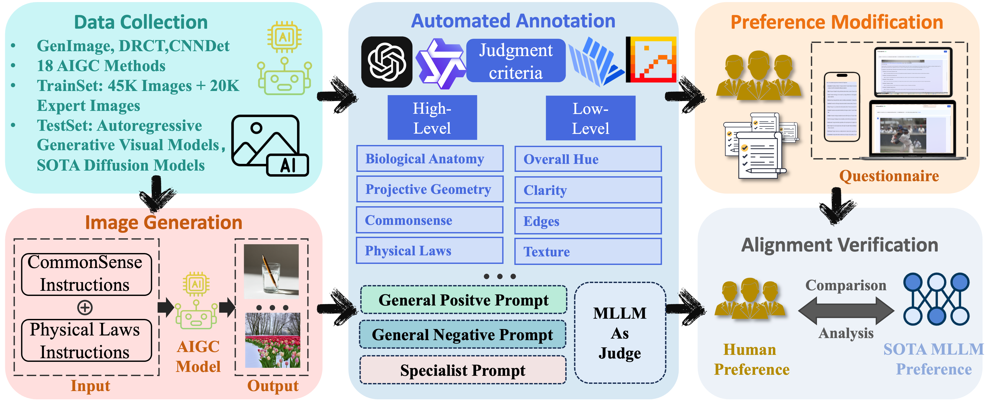

<div align="center">
<h1>🎉🎉🎉 AIGI-Holmes (ICCV 2025)</h1>
<h3>AIGI-Holmes: Towards Explainable and Generalizable AI-Generated Image Detection via Multimodal Large Language Models</h3>

Ziyin Zhou<sup>1*</sup>, Yunpeng Luo<sup>2*</sup>, Yuanchen Wu<sup>2</sup>, Ke Sun<sup>1</sup>, Jiayi Ji<sup>1</sup>,  
Ke Yan<sup>2</sup>, Shouhong Ding<sup>2</sup>, Xiaoshuai Sun<sup>1†</sup>, Yunsheng Wu<sup>2</sup>, Rongrong Ji<sup>1</sup>  
<sup>1</sup>Key Laboratory of Multimedia Trusted Perception and Efficient Computing, Ministry of Education of China, Xiamen University  
<sup>2</sup>Tencent YouTu Lab  

[GitHub](https://github.com/wyczzy/AIGI-Holmes) [[`Paper`](https://arxiv.org/abs/2507.02664)] [[`Demo`](#)] [[`BibTeX`](#citation)] [[`Dataset`](https://huggingface.co/datasets/zzy0123/AIGI-Holmes-Dataset/tree/main)]

</div>

---

## 💡 Abstract

> *The rapid development of AI-generated content (AIGC) technology has led to the misuse of highly realistic AI-generated images (AIGI) in spreading misinformation, posing a threat to public information security. Although existing AIGI detection techniques are generally effective, they face two issues: 1) a lack of human-verifiable explanations, and 2) a lack of generalization in the latest generation technology. To address these issues, we introduce a large-scale and comprehensive dataset, Holmes-Set, which includes the Holmes-SFTSet, an instruction-tuning dataset with explanations on whether images are AI-generated, and the Holmes-DPOSet, a human-aligned preference dataset. Our work introduces an efficient data annotation method called the Multi-Expert Jury, enhancing data generation through structured MLLM explanations and quality control via cross-model evaluation, expert defect filtering, and human preference modification. In addition, we propose Holmes Pipeline, a meticulously designed three-stage training framework comprising visual expert pre-training, supervised fine-tuning, and direct preference optimization. Holmes Pipeline adapts multimodal large language models (MLLMs) for AIGI detection while generating human-verifiable and human-aligned explanations, ultimately yielding our model AIGI-Holmes. During the inference stage, we introduce a collaborative decoding strategy that integrates the model perception of the visual expert with the semantic reasoning of MLLMs, further enhancing the generalization capabilities. Extensive experiments on three benchmarks validate the effectiveness of our AIGI-Holmes.*

<div align="center">
    
</div><br/>

<div align="center">
    
</div><br/>

## 📋 Table of Contents
1. [⚒️ Installation](#installation)
2. [🎯 ToDo List](#todo)
3. [🧰 Usage](#usage)
    1. [Dataset Preparation](#prepare)
    2. [Visual Pre-training](#visual-pre-training)
    3. [SFT & DPO](#SFT)
    4. [Inference](#inference)
4. [🔎 Citation](#citation)
5. [📜 License](#license)
6. [💗 Acknowledgement](#acknowledgement)

## ⚒️ Installation <a name="installation"></a>

### Environment Setup
```bash
# Create main environment
conda create --name aigi-holmes python=3.10 -y
conda activate aigi-holmes

# Clone repository and install
git clone https://github.com/wyczzy/AIGI-Holmes.git
cd AIGI-Holmes
pip install -e .
```

### Visual Expert Dependencies
```bash
# Install visual expert dependencies
cd Baselines_AIGI
pip install deepspeed==0.16.9 albumentations==1.4.0
pip install -r requirements.txt
```

### Inference Environment (Optional)
```bash
# Create inference environment with vLLM
# Recommended: build from source to access logits for demo
conda create --name myenv python=3.10 -y
conda activate myenv
git clone -b v0.8.5 https://github.com/vllm-project/vllm.git
cd ./vllm
pip install setuptools_scm
cd ./requirements
pip install -r cuda.txt
```

## 🎯 ToDo List <a name="todo"></a>

- [x] Release arxiv paper with complete BibTeX citation
- [x] Release visual expert pre-training code
- [x] Release SFT training code
- [ ] DPO training code and vLLM-based inference
- [ ] Collaborative decoding with logits processor
- [ ] Complete visual expert training documentation
- [ ] Detailed dataset preparation instructions
- [ ] Pre-trained model weights and download links
- [ ] Demo link and usage instructions
- [ ] Supplement the Acknowledgments section

## 🧰 Usage <a name="usage"></a> 

### Dataset Preparation <a name="prepare"></a>
Download training data from [zzy0123/AIGI-Holmes-Dataset](https://huggingface.co/datasets/zzy0123/AIGI-Holmes-Dataset). 

**Recommended directory structure:**
```
dataset/
    0_real/
    1_fake/
    *.jsonl
TestSet/
    FLUX/
        0_real/
        1_fake/  
    Infinity/
        0_real/
        1_fake/  
    Janus-Pro-1B/
    Janus-Pro-7B/
    Janus/
    LlamaGen/
    PixArt-XL/
    SD35-L/
    Show-o/
    VAR/
```

### Visual Pre-training <a name="visual-pre-training"></a>
For detailed instructions, see the documentation in `Baselines_AIGI/`:
- [README_CONFIG.md](Baselines_AIGI/README_CONFIG.md) - Configuration system usage
- [README.md](Baselines_AIGI/README.md) - Quick start guide

### SFT & DPO Training <a name="SFT"></a>

#### Supervised Fine-tuning (SFT)
```bash
CUDA_VISIBLE_DEVICES=0,1,2,3,4,5,6,7 NPROC_PER_NODE=8 swift sft \
    --model_id_or_path /path/to/llava-v1.6-mistral-7b-hf-ours \
    --model_type llava1_6-mistral-7b-instruct \
    --num_train_epochs 3 \
    --learning_rate 5e-5 \
    --warmup_ratio 0.03 \
    --batch_size 16 \
    --gradient_accumulation_steps 1 \
    --sft_type lora \
    --lora_rank 128 \
    --lora_alpha 256 \
    --freeze_vit true \
    --max_length 8192 \
    --deepspeed default-zero2 \
    --dataset /path/to/SFTDATA.jsonl \
    --output_dir ./work_dirs/llava_mistral_16_sft \
    --add_output_dir_suffix False \
    --save_total_limit 10 \
    --seed 0 \
    --eval_strategy no \
    --save_steps 500 \
    --val_dataset /path/to/val.jsonl
```

#### Direct Preference Optimization (DPO)
```bash
CUDA_VISIBLE_DEVICES=0,1,2,3,4,5,6,7 NPROC_PER_NODE=8 swift rlhf \
    --model_id_or_path /path/to/llava-v1.6-mistral-7b-hf-sft \
    --model_type llava1_6-mistral-7b-instruct \
    --num_train_epochs 1 \
    --learning_rate 5e-5 \
    --warmup_ratio 0.03 \
    --batch_size 8 \
    --gradient_accumulation_steps 1 \
    --sft_type lora \
    --lora_rank 32 \
    --lora_alpha 64 \
    --freeze_vit true \
    --max_length 8192 \
    --deepspeed default-zero2 \
    --dataset /path/to/DPODATA.jsonl \
    --output_dir ./work_dirs/llava_mistral_16_dpo \
    --add_output_dir_suffix False \
    --save_total_limit 10 \
    --seed 0 \
    --eval_strategy no \
    --save_steps 500 \
    --val_dataset /path/to/val.jsonl
```

#### Model Export
```bash
# Merge LoRA weights
swift export --ckpt_dir /path/to/lora/checkpoint --merge_lora True
```

### Inference <a name="inference"></a>
```bash
conda activate myenv

CUDA_VISIBLE_DEVICES=0 python -m vllm.entrypoints.openai.api_server \
    --model ./work_dirs/path/to/checkpoint \
    --tensor-parallel-size 4 \
    --served-model-name xtuner_try \
    --dtype=half \
    --trust-remote-code \
    --gpu-memory-utilization 0.9 \
    --enforce-eager \
    --max-model-len 24576 \
    --port 8030 \
    --logits-processor-pattern logits_processor_zoo.vllm
```

## 🔎 Citation <a name="citation"></a>
```bibtex
@article{zhou2025aigi,
  title={AIGI-Holmes: Towards Explainable and Generalizable AI-Generated Image Detection via Multimodal Large Language Models},
  author={Zhou, Ziyin and Luo, Yunpeng and Wu, Yuanchen and Sun, Ke and Ji, Jiayi and Yan, Ke and Ding, Shouhong and Sun, Xiaoshuai and Wu, Yunsheng and Ji, Rongrong},
  journal={arXiv preprint arXiv:2507.02664},
  year={2025}
}
```

## 📜 License <a name="license"></a>
AIGI-Holmes is released under the [Apache 2.0 license](LICENSE). Please refer to [LICENSE](LICENSE) for details, especially for commercial use.

## 💗 Acknowledgement <a name="acknowledgement"></a> 


